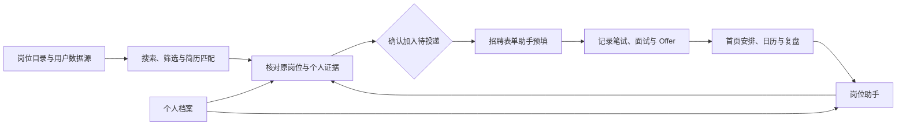
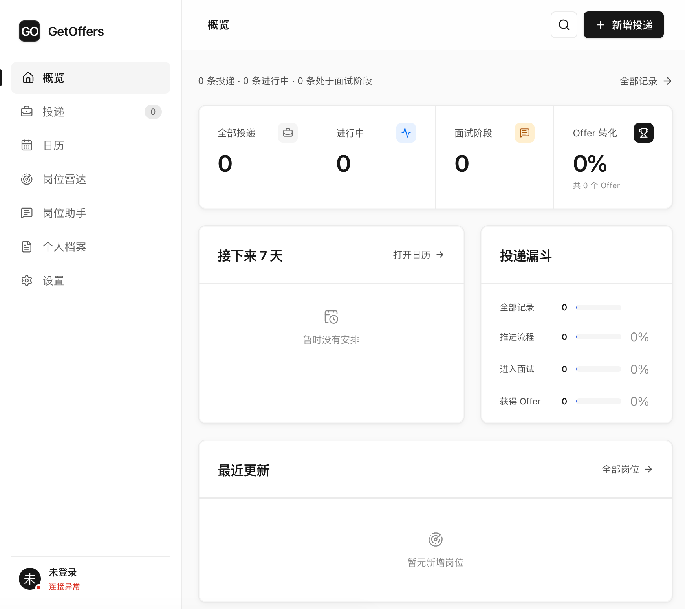
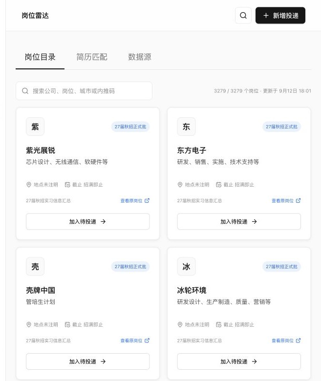
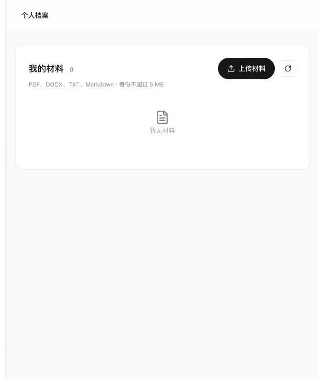
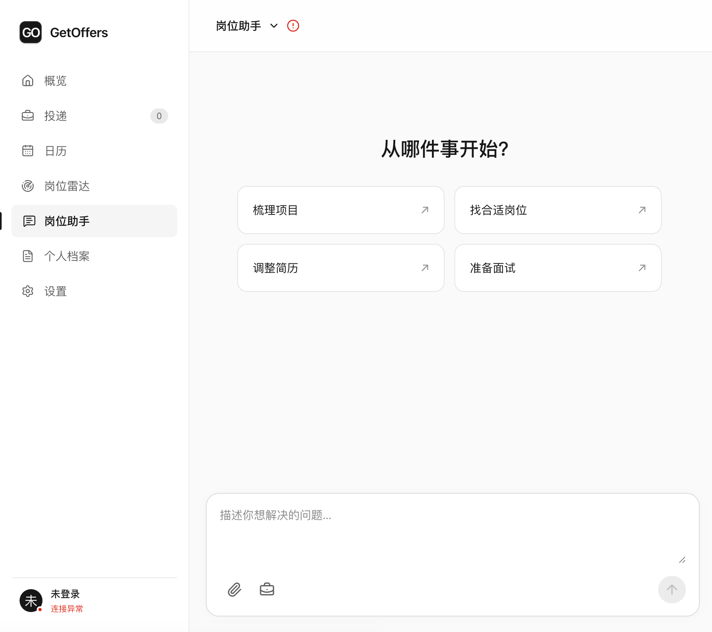

# GetOffers

**把散落在岗位表格、招聘网站、日历和聊天窗口里的求职动作，收回到一条可追踪、可复用、可核对的工作流。**

GetOffers 面向需要同时处理大量岗位、投递流程和求职材料的求职者。它覆盖岗位发现、材料管理、匹配核对、投递记录、流程提醒、表单预填和面试准备，让一次录入的信息能在后续环节持续复用。

它的重点不是替你盲目投递，而是减少重复记录，保留每次决策的依据，并把“是否加入待投递、填写什么、最终是否提交”留给你确认。

## 为什么使用 GetOffers

| 求职中的高频摩擦 | GetOffers 提供的帮助 | 带来的直接优势 |
| --- | --- | --- |
| 岗位散落在不同表格和网页 | 统一岗位目录、搜索、筛选和原链接 | 更快找到目标岗位，减少来回翻找 |
| 同一进度反复写进表格和日历 | 一次更新流程节点，首页、投递卡片和日历共同使用 | 降低记录成本，不容易遗漏下一步 |
| 简历、项目材料和 JD 各自分散 | 个人档案、带引用检索和岗位助手协同工作 | 辅导内容可以回到原材料核对，减少无依据补写 |
| 每个招聘网站都要重复填资料 | 浏览器扩展复用已确认的结构化资料 | 先预览再填写高置信度字段，减少机械输入 |
| 自动化越强，误操作风险越高 | 待投递写入需要确认，扩展不自动提交 | 提升效率的同时保留人工控制 |

## 一条完整的求职工作流



这条链路把“发现岗位”和“记录结果”连接起来：岗位信息进入待投递后继续保留来源，流程节点继续生成下一步安排，个人材料又能用于后续简历调整与面试准备。

## 功能一：投递记录与流程管理

围绕一条投递记录，集中保存公司、岗位、来源平台、薪资、简历版本和备注，并持续追加流程节点。

- 提供列表与看板两种视图，支持按公司、岗位、平台和阶段查找。
- 覆盖待投递、已投递、笔试、一面、二面、三面、HR 面、Offer 和已结束阶段。
- 点击阶段即可更新当前进展，并自动写入流程时间线。
- 未来时间的流程节点会同时出现在首页安排、投递卡片和日历中。
- 支持 JSON 导入与导出；Web 版记录写入账号隔离的 D1 数据库。



**效率优势：** 同一条进展只需记录一次，不必再手动同步到多个表格、待办和日历。

## 功能二：岗位雷达与数据源

岗位雷达把岗位浏览、筛选、来源核对和待投递记录放在同一入口。

- 在完整岗位目录中搜索公司、岗位、城市或内推码，并按招聘类型等条件筛选。
- 每条岗位保留来源与原岗位链接，方便回到招聘页面核对。
- 选中岗位后可直接加入待投递，避免再次复制公司和岗位信息。
- 支持按账号管理腾讯文档公开分享链接，可刷新、暂停或移除数据源。
- 刷新失败时保留上一次成功快照；移除来源不会删除已有投递记录。



_截图来自本地验收快照，岗位数量和更新时间不是长期固定值。当前用户数据源支持腾讯文档公开分享链接，不是任意网站抓取器。_

## 功能三：个人档案与证据管理

个人档案用于保存求职者主动选择的简历和项目材料，让后续匹配与辅导可以引用具体来源。

- 支持 PDF、DOCX、TXT 和 Markdown 材料。
- 保留材料版本、处理状态、原文位置和可回查引用。
- 候选事实可以确认、修正或拒绝；未经确认的内容不会自动变成确定事实。
- 支持材料替换、删除与失败重试，并按账号隔离数据。



**辅助优势：** 求职建议不再只依赖一段临时聊天上下文，而是能够围绕所选材料持续核对“已有证据、可迁移经验、短板和未知项”。

## 功能四：岗位助手

岗位助手通过受限的 Agent 工作流连接岗位、个人档案和投递记录，可用于：

- 梳理项目背景、个人职责、技术选择和实际结果。
- 根据目标 JD 组织简历草稿，同时标出缺少依据的信息。
- 基于岗位与材料准备面试问题、回答框架和复盘内容。
- 保存历史对话，并在需要时继续使用已选择的材料和 JD。
- 在本机模式下连接已登录的 Codex，也可以接入配置的模型服务。



**控制边界：** 助手可以检索和起草，但涉及写入待投递的动作仍需用户确认；当前真实材料质量基线与生产部署验收仍待完善。

## 功能五：招聘表单助手

浏览器扩展可以独立于 Web 应用使用，适合处理不同招聘网站上的重复资料填写。

1. 下载空白 `profile-template.json` 和严格的 AI 生成提示词。
2. 使用可信的 AI 服务，根据简历生成结构不变的 `profile.json`。
3. 人工检查姓名、联系方式、日期、经历顺序和敏感信息后导入扩展。
4. 在招聘页面先扫描并预览，再填写绿色高置信度字段。
5. 黄色字段、下拉框、协议、附件、验证码和最终提交由用户处理。


扩展使用 Manifest V3，只在用户点击后访问当前标签页；资料保存在浏览器本机的 `chrome.storage.local`。完整安装与使用步骤见[招聘表单助手使用说明](browser-extension/README.md)。

## 快速开始

### 只使用招聘表单助手

下载并解压项目，在 Chrome 或 Edge 的扩展管理页开启开发者模式，然后加载 [browser-extension](browser-extension/) 文件夹。这个路径不需要部署 Web 应用，也不需要运行后端服务。

### 本地运行 Web 应用

需要 Node.js 22.13 或更高版本：

```sh
npm install
npm run dev
```

Web 版接口依赖以下部署能力：

- 名为 `DB` 的 Cloudflare D1 binding，用于账号隔离的投递、材料元数据和工作流记录。
- OpenAI Sites 注入的 ChatGPT 登录用户请求头。
- 可选的 `JOB_FEEDS` R2 binding，用于独立保存岗位数据。

部署绑定声明位于 [.openai/hosting.json](.openai/hosting.json)，数据库迁移位于 [drizzle/](drizzle/)。浏览器扩展本身不依赖这些服务。

### 启动本机岗位助手

本机已登录 Codex 时运行：

```sh
npm run assistant:local
```

打开本地页面后，在侧栏进入“岗位助手”并选择模型。详细配置与验收边界见[本机 Codex 岗位助手说明](docs/experiments/local-codex-assistant.md)。

## 数据与安全边界

- Web 版投递记录和材料元数据保存在部署者配置的存储中，并按登录账号隔离。
- 个人材料、岗位证据和运行记录具有不同的访问范围；普通页面不暴露受限 Run Trace。
- 浏览器扩展资料只保存在本机浏览器，不设置全站常驻读取权限。
- 扩展不会自动提交表单、勾选协议、发送验证码或上传附件。
- 岗位助手的写操作需要审批绑定和参数校验，不执行自动投递。
- 不要把包含真实个人信息的资料 JSON、环境变量、运行 Trace 或本地模型数据提交到 Git。

## 当前交付边界

仓库已经提供可运行的本地工程基线、确定性测试、版本化评测材料和各功能入口，但这不等于完整生产发布或真实求职效果已经验收：

- 岗位搜索、知识库、确定性求职闭环、岗位助手和开发者评测查看均已有本地实现。
- 现有合成评测与接口测试证明工程契约和安全边界，不直接证明岗位推荐质量、简历质量或面试效果。
- 真实材料的人工质量基线、生产服务托管、远程存储适配和完整访问治理仍需继续验证。
- Phase 5 的面试专用工作流与多 Agent 实验尚未作为默认能力发布。

## 开发与验证

```sh
npm run lint
npm run build
npm test
npm run agent:check
npm run agent:test
```

本机开发者可以运行 `npm run assistant:developer`，在设置中查看脱敏运行记录、评测结果和配对比较。普通启动默认不开放该入口。

### 按功能查阅文档

| 功能 | 运行与验证 | 设计说明 |
| --- | --- | --- |
| Agent Runtime | [本地运行与验收](services/agent/README.md) | [Runtime 架构](docs/architecture/agent-runtime.md) |
| 岗位搜索 | [搜索运行指南](services/agent/SEARCH.md) · [验证边界](docs/experiments/phase1-job-search.md) | [岗位搜索与 RAG](docs/architecture/job-search-and-rag.md) |
| 个人档案 | [知识库运行指南](services/agent/KNOWLEDGE.md) · [验证边界](docs/experiments/phase2-knowledge.md) | [系统设计](docs/architecture/system-design.md) |
| 求职闭环 | [Phase 3 验证边界](docs/experiments/phase3-career.md) | [实施路线图](docs/architecture/implementation-roadmap.md) |
| 岗位助手 | [本机 Codex 验证](docs/experiments/local-codex-assistant.md) | [ReAct 助手设计](docs/architecture/assistant-react.md) |
| 评测与查看 | [评测说明](docs/experiments/phase4-assistant-evaluation.md) · [查看器说明](docs/experiments/phase4-developer-inspector.md) | [评测与可观测](docs/architecture/evaluation-and-observability.md) |
| 安全与隐私 | [审核与边界](docs/experiments/phase4-review-and-codex.md) | [安全架构](docs/architecture/security-and-privacy.md) |

全部架构决策记录见 [docs/adr/](docs/adr/)。

## 项目结构

```text
app/                 Web 界面与 API
browser-extension/   可独立安装的招聘表单助手
db/                  D1 数据访问与表结构
docs/                功能设计、架构与验证记录
drizzle/             数据库迁移
tests/               Web 端回归测试
services/agent/      Python Agent Runtime 与本地服务
datasets/evals/      版本化评测集
worker/              Cloudflare Worker 入口
```

## 技术栈

- React 19、TypeScript
- vinext、Vite
- Cloudflare Workers、D1、R2
- Python、Pydantic、SQLite、Qdrant
- Chrome Extension Manifest V3
