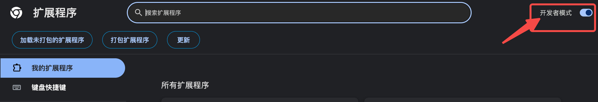
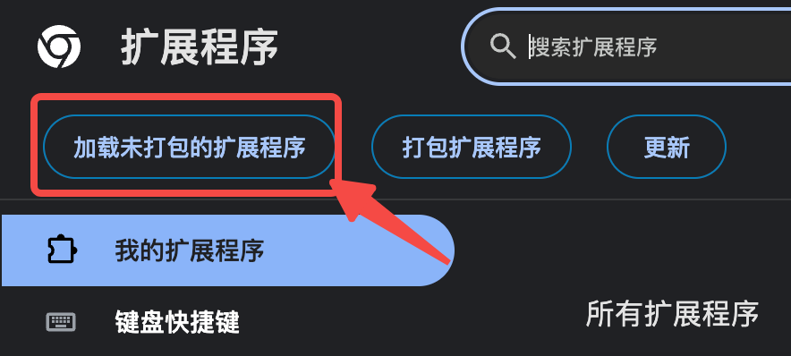

# GetOffers 招聘表单助手

这是一个可直接加载到 Chrome 或 Edge 的本地浏览器扩展。它会读取你主动导入的简历 JSON，扫描当前招聘页面，并只填写高置信度的普通字段。

不需要安装 Node.js，也不需要会写代码。第一次安装大约 3 分钟。

**更推荐的阅读方式：**安装后点击扩展右上角的“使用说明”，即可打开大字号、分步骤的网页式图文手册。下载项目后，也可以直接双击 [guide.html](guide.html) 查看，不必阅读下面的 Markdown 长文。

## 三分钟开始使用

### 1. 下载并解压项目

在 GitHub 项目页面点击 **Code → Download ZIP**，下载后双击解压。

### 2. 安装扩展

Chrome：

1. 在地址栏输入 chrome://extensions。
2. 打开右上角的“开发者模式”。
3. 点击“加载已解压的扩展程序”。
4. 选择解压后的 **browser-extension** 文件夹。

Edge 的操作相同，只需把第 1 步地址换成 edge://extensions。

> 上图是安装位置示意。不同版本的 Chrome 或 Edge 可能稍有差异，按钮名称和操作顺序相同。

### 3. 从 PDF/Word 简历快速生成 profile.json

推荐使用扩展内置的 AI 辅助流程，不需要自己理解 JSON：

1. 点击扩展图标，再点击“下载空白模板”。
2. 点击“复制 AI 生成提示词”。
3. 打开你信任且支持文件上传的 AI 助手。
4. 同时上传原始 PDF/Word 简历和刚下载的 profile-template.json。
5. 粘贴提示词并发送，让 AI 返回可下载的 profile.json。
6. 打开 profile.json 快速检查姓名、联系方式、日期和经历顺序。
7. 回到扩展，选择检查后的 profile.json。

内置提示词要求 AI 只提取简历中明确存在的事实，缺失项保持空白，多段经历按原顺序保存，并在输出前检查 JSON 格式。扩展导入时还会检查顶层结构、数组类型和空白模板，格式不正确会直接提示，而不会开始填表。

简历可能包含身份证号、电话、住址等敏感信息。只使用你信任的 AI 服务；如果不希望上传简历，可以用系统自带文本编辑器手动填写 profile-template.json。无论使用哪种方式，都应在导入前自行复核。

模板中的空值会被跳过；有多段教育、实习或项目经历时，应在对应数组中保留多个对象，并按简历顺序排列。

### 4. 填写招聘表单

1. 打开招聘申请页面，先登录并进入真正的简历表单。
2. 点击扩展图标，确认资料已导入。
3. 点击“扫描并预览”。
4. 查看结果：
   - 绿色“可填”：置信度高的普通文本字段。
   - 黄色“人工”：下拉框、日期、附件或存在歧义的字段。
   - 灰色“缺值/未知”：资料里没有，或扩展暂时无法识别。
5. 确认预览无误后，点击“填写绿色字段”。
6. 逐项复核页面，再由你手动处理黄色字段和最终提交。

多页表单需要手动切换页面，并在每一页重新执行“扫描并预览 → 填写绿色字段”。如果招聘网站让你新增第二段经历，也需要先手动新增，再重新扫描。

## 安全边界

扩展会：

- 只在你打开扩展并点击按钮后访问当前标签页。
- 只填写高置信度的普通文本字段。
- 在当前浏览器的本地存储中保存已导入资料，方便下次继续使用。
- 生成不包含字段值和简历内容的脱敏诊断，便于反馈兼容问题。

扩展不会：

- 点击提交、保存、删除或“获取验证码”。
- 勾选隐私、知识产权或其他协议。
- 绕过登录、验证码或 CAPTCHA。
- 上传照片、简历或其他附件。
- 自动创建新的教育、实习或项目条目。
- 把简历资料上传到 GetOffers 或第三方服务器。

不用时，可以在扩展弹窗中点击“清除”，删除浏览器内缓存的简历资料。卸载扩展也会清除缓存，但不会修改你保存在电脑上的 JSON 文件。

## 常见问题

### 按钮是灰色的

先导入填写好的 JSON 文件。“填写绿色字段”只有在完成一次扫描后才会启用。

### 提示当前页面无法扫描

浏览器设置页、新标签页和扩展商店不允许普通扩展运行。请进入实际招聘表单后再试；如果刚安装或更新过扩展，也请刷新招聘页面。

### 下拉框或日期没有自动填写

这是预期行为。很多招聘网站使用自定义组件，直接写入可能显示成功但实际没有选中，所以扩展会把它们保留为黄色人工项。

### 多段经历填错顺序

先确认网页上已经创建了足够数量的经历卡片，且 JSON 数组顺序与简历一致。仍有问题时，点击“复制脱敏诊断”，在项目 Issue 中说明网站和现象；诊断不会包含你的字段值。

### 更新后仍是旧效果

进入 chrome://extensions 或 edge://extensions，点击扩展卡片上的“重新加载”，然后刷新已经打开的招聘页面。

## 当前能力范围

扩展包含通用的中英文标签匹配、重复经历分组和 ATS 薄适配，可处理常见原生表单，以及飞书招聘、北森、Moka、智业和部分企业自研招聘页面的常见结构。招聘网站经常改版，无法保证每个字段都能识别；安全策略始终优先于填充数量。

## 文件说明

- manifest.json：扩展入口与最小权限声明。
- popup.*：导入资料、预览和执行填写的界面。
- matcher.js：字段语义匹配。
- grouping.js：教育、实习、项目等重复经历分组。
- ats-adapter.js：不同 ATS 的薄适配规则。
- content.js：页面扫描、标记与安全填写。
- profile-template.json：不含真实个人信息的空白资料模板。
- profile-generation-prompt.txt：把 PDF/Word 简历转换为 profile.json 的严格提示词。
- profile-utils.js：导入前的资料结构和空值校验。

本目录不包含任何真实简历、公司网页快照、公司诊断脚本或测试残留。
