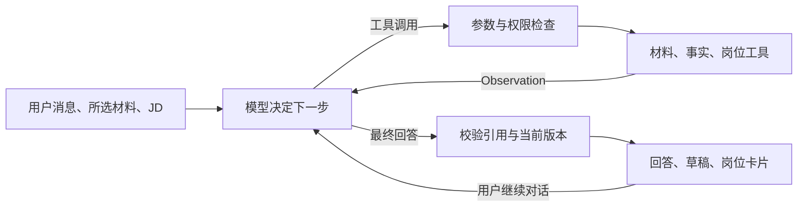

# 岗位助手：单 Agent ReAct

日期：2026-09-07。状态：实现与合成流程验证完成；真实模型未配置，回答质量未验收，未部署。

## 产品入口与产物

“岗位助手”在现有侧栏中打开，内容显示在右侧。页面可以选择知识库已处理的当前材料版本、粘贴目标 JD、连续对话。四个起始按钮填入可编辑问题，分别对应项目梳理、找岗位、调整简历、面试准备。

材料引用可展开查看原文和来源；草稿可编辑、复制、导出 Markdown。岗位卡片提供原岗位链接，可以将岗位要求带入简历/面试任务，或打开现有新增投递表单，由用户检查并保存。模型没有写入或提交投递工具。页面不展示内部推理、工具代码名或虚构匹配分。

对话与草稿只在当前浏览器页面内存中保留，侧栏切换后仍在，刷新/关闭后丢失；更换材料需要开始新对话。编辑后的草稿会进入后续对话上下文。当前没有持久聊天列表、Word/PDF 简历排版导出、原材料覆盖保存或模拟面试评分。

## 编排与依赖

编排采用单 Agent ReAct：每次模型调用可以输出一次工具调用，或最终回答。工具返回作为 Observation 进入下一次调用，步骤顺序由模型选择。项目梳理等四种任务共用一个 Agent；检索和排序仍是确定性模块。



| 层 | 当前实现 |
| --- | --- |
| Agent 编排 | 自研 Python `AgentRuntime`，复用 Phase 0 循环、事件、预算与 ToolPolicy |
| 结构校验 | Pydantic：请求、工具参数/返回、最终回答与草稿 |
| 并发与取消 | Python `asyncio`；同步 HTTP/检索通过 `to_thread` 调用 |
| 模型接入 | Python 标准库 `urllib`，OpenAI 兼容 Chat Completions function calling |
| 检索 | 现有 Knowledge / Job Search 服务与 Qdrant；助手默认词法检索，可配置混合检索 |
| 产品接口 | TypeScript `/api/assistant` 绑定登录身份，转发 NDJSON 进度与最终结果 |
| 页面 | React / TypeScript；已有 Vinext 应用，不增加独立页面路由 |

没有引入 LangChain、LangGraph 或多 Agent 框架。模型适配器与运行时分开，可替换模型服务而不改工具权限或产品身份边界。[Chat Completions 官方接口](https://developers.openai.com/api/reference/typescript/resources/chat/subresources/completions/methods/create)提供工具调用协议；兼容服务仍需实际确认 `tools`、`parallel_tool_calls`、`store`、`max_tokens` 和 token usage 字段是否支持，不能据协议兼容推断所有模型可用。

## 工具与运行约束

- `get_candidate_state`：读取所选材料的已确认/修正事实，保留原始证据引用。
- `retrieve_evidence`：仅检索所选文档，返回原文、位置和版本；引用再次按用户权限读取。
- `search_jobs`：调用已有搜索，保留城市与排除条件，返回最多 5 个真实岗位版本。
- `get_job`：读取本轮检索中出现的岗位。
- `read_target_jd`：读取用户粘贴的目标 JD。

所有工具都是只读；模型无权指定账号、扩大材料范围、调用任意 URL 或新增工具。工具调用参数经 Pydantic 和 ToolPolicy 校验后才执行。来源内容和历史回答作为非可信数据处理。提示词要求区分原文、用户确认事实、口述、可迁移经验与未知，不把“设计过”改写为“做过”。

每轮最多 8 次模型调用；提示词建议最多 6 次工具。运行时有 5 分钟截止时间、重复无进展检测、累计输入 120000 / 输出 16000 token 预算；每次模型输出默认最多 3000 token。输入预算依据供应商实际 usage 在调用后核算，因此最后一次调用可能越过累计输入上限，不构成精确预付费额度控制。缺失 usage、截断、畸形 JSON 或并行工具响应均不当作成功结果。未配置价格时费用返回 null；配置两项每百万 token 单价后才计算费用。

同账号同进程只允许一个活动请求；已完成 request_id 在进程内去重，元数据有数量上限。跨进程幂等、限流和服务治理尚未实现。本地 HTTP 服务只监听 loopback，不是生产托管方案。停止/断连阻止后续工具和模型调用；已发出的同步供应商 HTTP 请求可能继续到 90 秒超时，不能保证远端立即停算或停止计费。

## 引用、隐私与回放

回答返回前重新校验所选材料的当前版本、使用过的已确认事实修订、引用 ID/原文，以及展示岗位是否仍在搜索结果中。删除、换版、事实修改或伪造引用会阻止结果返回。项目/简历成稿必须有本轮实际引用；针对 JD 的成稿须有用户 JD 或本轮检索岗位。

这些是结构和来源检查，**不等于逐句语义事实核验**。某段生成文本是否被引用充分支持、是否遗漏关键限制，仍需真实模型评测与人工复核。

本轮消息、JD、工具结果与完整 Run Event 只留在内存中，支持请求执行期间回放；不做服务重启后恢复。服务仅落盘允许字段的运行耗时、状态、token 与 Context Manifest 哈希，不保存聊天/草稿/原文。审计文件按账号哈希与 run_id 区分，文件权限 0600；审计写失败不阻塞下一轮。历史 Phase 0 和确定性 Career 工作流继续沿用各自持久事件策略。

调用模型会将当前对话、目标 JD 和检索出的所选材料片段发送到所配置的模型服务；这与“不在本应用持久存储正文”是不同边界。供应商保留策略需按所选服务单独确认。未提供密钥时页面显示未启用，不返回演示答案。

## 本地配置

模型必须支持工具调用。将以下变量注入 Python 服务环境；不要把真实密钥提交仓库或写到聊天中。虚拟环境沿用已安装依赖，启动时不移除 documents/neural/r2 可选依赖。

```text
LLM_BASE_URL=https://你的模型服务/v1
LLM_MODEL=支持工具调用的模型名
LLM_API_KEY=模型密钥
AGENT_ASSISTANT_TOKEN=至少32字符的独立服务密钥
AGENT_KNOWLEDGE_URL=http://127.0.0.1:8767
AGENT_KNOWLEDGE_TOKEN=现有知识库服务密钥
AGENT_SEARCH_URL=http://127.0.0.1:8766
AGENT_SEARCH_TOKEN=现有搜索服务密钥
ASSISTANT_RETRIEVAL_MODE=lexical
```

可选 `LLM_INPUT_PRICE_PER_MILLION` / `LLM_OUTPUT_PRICE_PER_MILLION` 均为美元计价。启动已配置的 Knowledge/Search 后运行 `npm run assistant`（默认 8780）；模型环境变量不会自动从产品 `.dev.vars` 加载。

产品 `.dev.vars` 配置并重启开发服务器：

```text
AGENT_ASSISTANT_URL=http://127.0.0.1:8780
AGENT_ASSISTANT_TOKEN=与Python服务相同的独立服务密钥
```

材料选择器继续需要产品现有的 `AGENT_KNOWLEDGE_URL/TOKEN`。浏览器使用正常产品登录；模型密钥只在 Python 服务中。运行 `npm run assistant:test` 检查助手契约；全量回归沿用现有测试入口。

## 验证记录与剩余工作

本次以真实 Runtime、知识库和岗位索引配合**脚本化测试模型响应**验证工具闭环：引用/草稿、多轮历史、北京城市条件、JD 面试提纲、越权与伪造引用、删除/事实更新、未知工具/参数注入、模型截断/缺失 usage、步数上限、取消与审计失败。TypeScript 测试验证登录身份、请求大小、重定向拒绝、逐段流转发、模型 HTML/链接保持惰性文本。

浏览器在用户已授权的本机隔离网关中验证：选择合成简历 → 生成项目草稿 → 展开引用 → 编辑/复制 → 切到设置再返回仍保留 → 继续搜索并显示北京岗位卡片。网关将助手和知识库请求直接接到隔离测试服务；产品代理的身份/流传输由单独契约测试覆盖，因此不把这次浏览器流程描述成完整真实登录端到端验收。没有保存投递记录或对外提交；测试网关与模型服务已停止。

真实模型调用、任务质量基准、完整正常登录链路和生产部署仍待完成。后续需用经人工审核的项目/JD 用例比较引用支持、事实保持、约束遗漏、输出实用性、延迟与成本，再决定是否引入更复杂编排或语义核验。

## 2026-09-10 后续进展

已新增本地模型配置加载、助手评测、Trace 验证回放、人工审核回填和配对比较，见 [Phase 4 首个切片](../experiments/phase4-assistant-evaluation.md)。普通聊天的内存存储策略不变；完整 Trace 仅由显式本地评测收集。本地真实模型配置仍缺失。


## 2026-09-11 本机 Codex 接入

新增本地 Codex CLI Provider、真实 Codex 账号连接、前端模型选择和一条命令启动的本地服务。无材料真实模型对话已在浏览器完成；真实材料对话等待用户选定文件，质量门槛不变。详见 [本机 Codex 验收记录](../experiments/local-codex-assistant.md)。OpenAI-compatible Provider 仍可按原配置单独启动。


## 2026-09-12 产品会话持久化

顶部历史下拉可恢复并继续对话。产品 API 将用户消息、回答、草稿和所选材料版本/JD 保存到账号隔离的对话表，使用乐观修订号避免旧窗口覆盖。原始知识库引用段落不复制到会话表；内部推理和 Run Event 存储规则不变。此前“前端只在内存中保留对话”的限制由本次变更替代。参见 [实现与验收记录](../experiments/assistant-conversation-history.md)。
