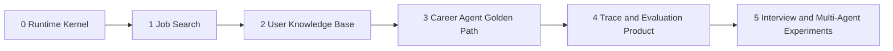

# Implementation Roadmap

## Delivery principle

Build one vertical slice at a time and keep each slice runnable, measurable, and explainable. The first objective is not the most capable Career Agent; it is a reproducible Harness and evaluation loop that can prove later improvements.

This document is an implementation plan. Phase status notes link to measured acceptance reports; all other components and performance results remain targets.

## Phase map



Each phase ends with executable tests, a versioned dataset/configuration where applicable, and a short experiment report. Do not postpone evaluation until Phase 4; Phase 4 productizes the evaluation system built alongside Phases 0-3.

## Phase 0 — Thin Agent Runtime

**Local implementation delivered (2026-09-05):** `services/agent/` now provides the
runtime slice, CLI, deterministic tests, and a synthetic paired Evaluation Runner.
See [the acceptance report](../experiments/phase0-runtime.md) for measured checks and
remaining production boundaries, and [the local guide](../../services/agent/README.md)
to run it. Later phase status is recorded separately below.

### Goal

Learn and implement the essential Agent Harness lifecycle independently of a framework while keeping provider and storage seams replaceable.

### Build

- Create `services/agent/` as a Python package with runtime, domain, adapter, and test modules.
- Define Pydantic contracts for Session, Workflow Run, Agent Run, Step, Outcome, Run Event, Budget, Context Manifest, Tool Spec, Tool Request/Result, Approval, and error categories.
- Implement a bounded Agent loop with maximum steps, deadline, token/cost fields, no-progress stop, cancellation, and terminal outcomes.
- Implement Tool Registry plus separate Tool Spec, Handler, and Policy responsibilities.
- Implement dynamic tool exposure by workflow stage.
- Add fake Model Provider and fake Product Port for deterministic tests.
- Add in-memory Event Store first and SQLite Event Store for reproducible local runs.
- Implement checkpoint projection, resume, and replay without side effects.
- Emit usage, duration, configuration identity, and redacted error events.
- Provide one CLI or test fixture that runs a tiny read-tool workflow end to end.

### Tests

- Event ordering, schema-version parsing, and projection determinism.
- Budget, cancellation, timeout, and repeated-no-progress stops.
- Unknown tool, malformed arguments, hidden tool, and policy denial.
- Write approval grant/reject/expire, canonical-argument mutation, idempotency, and ambiguous retry.
- Replay makes zero provider/tool calls.
- Sensitive values do not enter operational event projections.

### Exit criteria

A deterministic local run can start, call a read tool, pause/resume for an approved write, complete, reconstruct its outcome from events, export redacted spans, and replay without repeating the write. All paths have stable error categories and tests.

## Phase 1 — Job Search as a first-class retrieval system

**Local engineering baseline (2026-09-06):** versioned facts, Qdrant indexing,
four retrieval configurations, ranking/evidence contracts, authenticated product
query interface, and the paired evaluation runner are implemented. See
[the guide](../../services/agent/SEARCH.md) and [verification report](../experiments/phase1-job-search.md).
The official JD snapshot has 150 machine-proposed query/label cases, **not 150
human-reviewed cases**. Dataset review and empirical release thresholds remain
open; this is not a declaration that the full Phase 1 quality gate has passed.

### Goal

Replace UI-oriented filtering as the primary discovery mechanism with an independently evaluated whole-job ranking pipeline.

### Build

- Define D1 fact schema and migrations for job sources, immutable Job Versions, active versions, collection/index manifests, and ingestion runs.
- Preserve current feed compatibility through a Product Port while migrating new normalized facts deliberately.
- Run Qdrant locally with a versioned `job_versions_v1` collection.
- Implement deterministic job normalization, content hashing, versioning, stale-state, and duplicate candidates.
- Implement server-bound metadata/Hard Constraint filters.
- Establish the baseline: Qdrant BM25 + BGE-M3 dense + RRF + BGE reranker-v2-m3.
- Add explicit ranking features for requirement/responsibility match, negative-duty penalty, freshness, source quality, preferences, and duplicate/diversity adjustment.
- Return score components, matched fields, Job Evidence identities, and search configuration version.
- Create a reviewed Job Search dataset of about 150 queries with graded relevance, Hard Constraints, exclusions, and Job Version IDs.
- Add an experiment runner that compares lexical, dense, hybrid, and hybrid-plus-reranker configurations on the same cases.

### Tests

- Job normalization/version and duplicate property tests.
- Tenant/visibility and Hard Constraint filter tests.
- Known-relevant retrieval and negative-role intrusion cases.
- Stale/inactive versions never returned.
- Index manifest/rebuild/alias activation tests.
- Deterministic metric calculations and paired experiment identity.

### Exit criteria

The product can request Ranked Jobs through one typed interface and receive reproducible results from a pinned corpus/index/configuration. A baseline report includes Recall@K, MRR, nDCG, constraint violations, duplicate/stale rate, p50/p95 stage latency, and measured resource/cost accounting.

## Phase 2 — User Knowledge Base and grounded evidence

2026-09-06：本地工程基线已实现，见 [运行指南](../../services/agent/KNOWLEDGE.md) 和 [验证报告](../experiments/phase2-knowledge.md)。当前提供知识库页面、真实 Docling 适配、四组检索、事实审核、版本替换和可重试删除。人工审核 Gold、远程 D1/R2 验证、生产解析隔离、定时 reconciliation、确认事实到匹配及 Run Trace 的集成仍待完成；以下完整 exit criteria 尚未宣告通过。

### Goal

Let users upload resumes and project materials, turn them into private cited evidence, and confirm structured Candidate Facts.

### Build

- Add a Knowledge Base page with upload, processing status, version, failure reason, source preview, Candidate Fact review, and delete actions.
- Add authenticated Product interfaces for document metadata, upload preparation, processing status, Candidate Fact review, and deletion.
- Store immutable source/canonical artifacts in R2 using tenant/document/version/content-hash paths.
- Implement PDF/DOCX through a Docling adapter and deterministic Markdown/TXT parsers behind the Canonical Document contract.
- Build document-aware Evidence Units with hierarchy and Source Locators; keep token limits in versioned configuration.
- Index private `evidence_units_v1` points in Qdrant with server-injected tenant filters.
- Implement hybrid Evidence Retrieval, reranking, optional parent/neighbor expansion, deduplication, and token-budgeted Evidence Packs.
- Propose Candidate Facts with supporting Evidence IDs; require user confirmation/correction before hard matching.
- Implement the deletion saga and reconciliation worker across D1, Qdrant, R2, facts, caches, and covered trace payloads.
- Create a Parsing Gold Corpus of 40-60 documents and an Evidence Retrieval set of about 100 reviewed questions.

### Tests

- Parser adapter contract and deterministic Canonical Document snapshots.
- Structure, reading-order, locator, table, empty/corrupt/encrypted, and resource-limit cases.
- Evidence Unit boundary, parent/child, maximum-size, and citation round-trip tests.
- Cross-tenant retrieval and prompt-injection security tests.
- Candidate Fact lifecycle and evidence-link integrity.
- Deletion failure at every step, retry, and zero-match verification.

### Exit criteria

A user can upload a supported document, observe processing, retrieve citations that open the correct source location, confirm or reject proposed facts, use confirmed facts in matching, and verify document deletion. Parsing and Retrieval reports are versioned and reproducible.

## Phase 3 — Career Agent golden path

2026-09-06: the deterministic product slice is implemented and locally verified. See
[Phase 3 implementation and remaining gates](../experiments/phase3-career.md).
That discovery controller makes no LLM calls. A separate [conversational ReAct assistant](assistant-react.md) now uses a configurable model adapter and the same bounded Runtime. Its tool/UI contracts are tested with a scripted model transport; live-model quality and production deployment remain open. This is not a declaration that every exit criterion below has passed.

### Goal

Connect the Runtime, Job Search, User Knowledge, and product facts into one safe Job Discovery workflow.

### Build

- Implement the deterministic Job Discovery state machine: understand request, load trusted state, clarify only blocking ambiguity, search, retrieve evidence, explain, validate, propose plan, request approval, and commit.
- Expose narrow tools such as `get_candidate_state`, `search_jobs`, `retrieve_evidence`, `get_application_facts`, and `create_application_plan`.
- Assemble a versioned Context Manifest for every model call.
- Generate Decision Explanations that separate matched evidence, transferable evidence, gaps, assumptions, and unknowns.
- Validate citation identities, source locators, Hard Constraints, unsupported claims, and write arguments before presentation or execution.
- Connect the existing human-clicked Chrome autofill flow only by showing approved plan/status data; do not add autonomous form submission.
- Add a golden-path UI showing progress, evidence, explanations, assumptions, and the exact pending write for approval.
- Convert reviewed real workflows and Bad Cases into Evaluation Cases.

### Tests

- Workflow state and transition tests, including cancellation and recovery.
- Expected/forbidden tool selection and argument checks.
- Missing Hard Constraint versus soft-preference behavior.
- Citation support and unsupported-experience claim checks.
- Exact approval payload, duplicate-click/idempotency, and write read-back.
- End-to-end upload → fact confirmation → search → explanation → approval → Application Plan.

### Exit criteria

The full golden path works locally from the product UI with no manual database edits. Every outcome has a Run Trace, citations, configuration versions, token/cost/latency accounting, and a passing safety/evaluation result. No application is submitted automatically.

## Phase 4 — Developer observability and evaluation product

2026-09-10: the [local assistant evaluation and review slice](../experiments/phase4-assistant-evaluation.md) is implemented. Frozen synthetic inputs, trace verification, CSV review binding, and paired comparisons are available. Real-model/Core-set quality, deployed adapters, developer UI and access governance remain open; the full Phase 3 and Phase 4 exit criteria have not passed.

2026-09-12: the [local developer inspector](../experiments/phase4-developer-inspector.md) now exposes redacted run timelines, verified evaluation results and read-only paired comparisons inside Settings. Access requires explicit local developer opt-in and a valid Codex session. Hosted capability governance, restricted traces, reviewed real-model quality and deployment remain open.

2026-09-13: [bound review views and local Codex evaluations](../experiments/phase4-review-and-codex.md) are implemented. The inspector validates operator-provided reviewed.csv files and displays coverage and paired label deltas without exposing reviewer details. One synthetic case passed real Codex contract checks and trace replay; human quality remains pending. Full Phase 4 exit criteria remain open.

### Goal

Turn the test-time evaluation loop into an operable, permissioned development system without exposing sensitive traces to ordinary users.

### Build

- Add D1 Event Store and R2 restricted-payload adapters while retaining in-memory/SQLite local adapters.
- Derive OpenTelemetry-compatible workflow, agent, model, retrieval, tool, approval, and outcome spans from Run Events.
- Add redaction, retention, sampling, audit, and access-policy enforcement.
- Build a developer-only Runs page with filters, stage timings, token/cost breakdown, tool/retrieval timeline, failure category, and redacted payload views.
- Build an Evaluation page for dataset versions, Baseline/Challenger configuration diff, paired metric deltas, Bad Cases, and release-gate decisions.
- Support capabilities `trace:read:redacted`, `trace:read:restricted`, `metrics:read`, `evaluation:read`, `evaluation:run`, and `evaluation:manage`.
- Require reason, expiry, and audit for restricted trace access.
- Add production Bad Case triage and a reviewed promotion path into Core/Edge cases.
- Add reversible Champion/Challenger configuration and index activation.

### Tests

- Run Event-to-span projection and exporter-failure isolation.
- PII/secret redaction and restricted-access denial/audit.
- Dataset/configuration pinning and deterministic metric recomputation.
- Pairing correctness, missing-case detection, grader versioning, and lockbox access.
- Release-gate pass/fail and rollback behavior.
- Performance regression tests with stable local fixtures.

### Exit criteria

An authorized developer can diagnose one workflow from outcome down to a slow or failing stage, reproduce it from pinned inputs, run a paired Challenger, inspect metric and cost deltas, and make an auditable gate decision. An ordinary user cannot access full Trace or Evaluation data.

## Phase 5 — Interview workflow and evaluated Multi-Agent experiments

### Goal

Expand product value only after the single-Agent baseline is stable and measurable.

### Build

- Add Mock Interview as a Career Workflow grounded in selected Job Evidence and the user's project/resume Evidence Units.
- Preserve question, answer, follow-up, feedback, and revised answer as one interview Evidence Unit.
- Evaluate single-Agent interview planning, questioning, evidence checking, and review generation first.
- Add read-only Job Analyst child Agent Runs as a Challenger for selected multi-job comparisons.
- Implement delegation budgets, evidence scope, parallel join, cancellation, partial failure, and parent synthesis using the existing Run Event model.
- Consider a dedicated Interview Agent/handoff only when role specialization produces a measurable gain.

### Promotion rule

Multi-Agent execution remains disabled by default unless paired evaluation shows meaningful quality improvement while satisfying safety, error, p95 latency, and cost-per-success gates. A more complex trace is not evidence of a better product.

## Cross-phase test strategy

| Layer | Purpose | Examples |
|---|---|---|
| Unit | Local invariants and algorithms | RRF, metrics, chunk boundaries, canonicalization, budgets |
| Property | Broad invariant search | Event sequence, idempotency, version activation, deduplication |
| Contract | Replaceable adapters obey one behavior | Model, Product Port, Event Store, Parser, Vector Store |
| Integration | Real local dependencies | SQLite/D1 adapter, R2-compatible storage, Qdrant, parser/model adapters |
| Workflow | Domain state and policy | Job Discovery, approval, deletion, resume |
| Evaluation | Quality on frozen cases | Parsing, Job Search, Evidence Retrieval, Agent outcomes |
| End to end | User-visible golden path | Upload through approved Application Plan |
| Security | Zero-tolerance boundaries | Tenant isolation, injection, trace access, deletion |

Every defect that escapes a lower layer becomes the smallest reproducible regression case at the appropriate layer. Network-dependent tests are labelled and do not replace deterministic local gates.

## Initial issue breakdown

Recommended implementation order within the repository:

1. Scaffold Python package and typed Runtime contracts.
2. Implement Event Store, projections, fake adapters, and lifecycle tests.
3. Implement tool/policy/approval/idempotency contracts and tests.
4. Define Job Version facts and one-time normalization/indexing path.
5. Establish Qdrant BM25 and dense baseline plus metric runner.
6. Curate and freeze Job Search evaluation V1.
7. Add upload/product contracts and immutable document storage.
8. Implement Canonical Document parsers and Parsing Gold tests.
9. Implement Evidence Units, private hybrid retrieval, and citations.
10. Implement Candidate Fact review and deletion saga.
11. Connect the Job Discovery workflow and UI golden path.
12. Add deployed Event Store, span projection, developer Runs/Evaluation pages, and gates.
13. Run model/search-engine Challengers one factor at a time.
14. Start Mock Interview and Multi-Agent work only after the baseline gate.

Each issue should state the contract changed, invariants, threat cases, evaluation impact, rollback path, and evidence required for completion.

## V1 definition of done

V1 is complete only when all of the following are demonstrated from a clean local setup:

- A user uploads a supported resume or project document and sees processing status.
- The document becomes versioned, cited Evidence Units; proposed Candidate Facts require review.
- Job Search returns whole ranked jobs using a documented hybrid pipeline and respects Hard Constraints.
- The Career Agent explains matches and gaps with valid Job and User Evidence.
- Creating an Application Plan pauses for approval of exact arguments and is idempotent.
- Replay does not invoke models, retrieval, or tools and never repeats a write.
- A developer can inspect a redacted Run Trace and reproduce a pinned evaluation.
- Ordinary users cannot access full Trace/Evaluation, other tenants' data, or restricted payloads.
- Deletion is verified across facts, artifacts, indexes, caches, and applicable restricted payloads.
- Baseline reports include quality, safety, p50/p95 latency, tokens, measured/estimated cost with pricing version, errors, and cost per successful workflow.
- Zero-tolerance security gates pass and all implementation claims are backed by tests or experiment artifacts.

## Resume evidence checklist

Do not write architecture intentions as completed experience. Promote a claim to the resume only when its artifact exists and is reproducible.

| Possible claim area | Required evidence |
|---|---|
| Agent Harness | Bounded loop, event/replay tests, approval/idempotency test, provider/tool adapters |
| Hybrid job ranking | Frozen dataset, configuration manifest, Baseline/Challenger report, Bad Cases |
| User RAG | Parser Gold results, Evidence Retrieval metrics, citation and tenant-isolation tests |
| Evaluation loop | Versioned cases/graders, paired report, release-gate record |
| Observability | Trace screenshot/export, stage timing and cost attribution, redaction/access tests |
| Reliability/privacy | Deletion saga test, prompt-injection tests, tenant isolation and unapproved-write gates |
| Multi-Agent | Paired single-versus-multi report demonstrating the stated trade-off |

A truthful future bullet should use measured placeholders until experiments exist:

```text
设计并实现可回放的求职 Agent Harness，将岗位混合检索、用户知识库与人工审批工具接入统一 Run Event 链路；在 [N] 条人工标注用例上将 [指标] 从 [基线] 提升至 [结果]，同时将 p95 时延控制在 [数值]、单次成功工作流成本控制在 [数值]，并以租户隔离、未授权写入和提示注入零容忍门禁保障发布。
```

Before measurement, describe this work as architecture/design or in-progress implementation, not as achieved production performance.

## Stop rules and risks

- Do not add another framework before the Runtime contracts and first golden run are stable.
- Do not tune chunk size or model choice without a frozen case set and versioned experiment.
- Do not train a ranking model until reviewed relevance data is sufficient and the explicit baseline is understood.
- Do not expose a product endpoint as a model tool merely because it already exists.
- Do not enable broad formats, OCR, or remote providers without updating privacy, threat, and evaluation cases.
- Do not make Multi-Agent the default to create architectural spectacle.
- Do not publish metrics from synthetic-only data, an unpinned corpus, or cherry-picked queries.
- If infrastructure work blocks the golden path, return to local adapters and preserve the interface rather than expanding the deployment surface.

## Architecture references

- [System design](system-design.md)
- [Agent Runtime](agent-runtime.md)
- [Job Search and RAG](job-search-and-rag.md)
- [Evaluation and observability](evaluation-and-observability.md)
- [Security and privacy](security-and-privacy.md)
- [Architecture Decision Records](../adr/)
