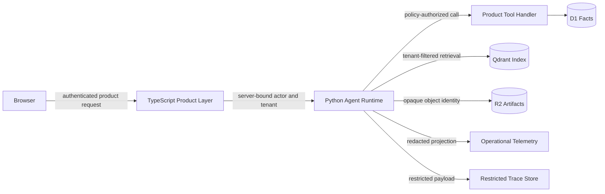

# Security and Privacy

## Security objective

GetOffers processes resumes, project descriptions, interview records, job preferences, and application history. These materials can contain identity, contact, employment, education, and confidential project information. The security boundary therefore applies to every ingestion, retrieval, Agent, tool, trace, evaluation, and deletion path—not only to the upload page.

The core invariants are:

```text
cross-tenant disclosure = 0
unapproved business write = 0
retrieved-content privilege escalation = 0
deleted content retrievable after verified completion = 0
hidden chain-of-thought collection = 0
```

## Trust boundaries



- The browser is untrusted input, even after login.
- Job text, uploaded documents, retrieved Evidence Units, model output, and plugin output are untrusted data.
- The TypeScript Product Layer establishes authenticated actor, tenant, ownership, and product authorization.
- The Agent Runtime may narrow authority but may not broaden it.
- D1 is the fact source, R2 is the artifact source, and Qdrant is a rebuildable index. Qdrant payload is never an authorization source.
- The browser and model never receive direct unrestricted credentials for D1, R2, Qdrant, trace storage, or index administration.

## Data classification

| Class | Examples | Default handling |
|---|---|---|
| Public | Public Job Versions, shared coaching material | May be indexed in shared scope; provenance retained |
| Private | User documents, Candidate Facts, Application Facts | Tenant-bound storage and retrieval; encrypted transport; least-privilege access |
| Restricted | Resume contents in traces, model inputs/outputs, raw tool payloads | Excluded from ordinary telemetry; short retention; audited access |
| Secret | API keys, signing keys, provider credentials | Secret manager/environment binding only; never placed in prompts, indexes, events, or logs |

Sensitivity is assigned at ingestion and propagated to derived data. A derived embedding, summary, Candidate Fact proposal, or evaluation sample cannot receive a less restrictive classification merely because its wording changed.

## Identity and tenant isolation

Every internal request carries a server-generated security context:

```python
class SecurityContext(BaseModel):
    actor_id: str
    tenant_id: str
    roles: set[str]
    capabilities: set[str]
    request_id: str
```

`actor_id`, `tenant_id`, roles, and capabilities are ignored if supplied by model output, tool arguments, query strings intended for retrieval, or uploaded content. Storage adapters bind tenant filters from `SecurityContext` and reject calls without one.

Isolation must be enforced twice for private retrieval:

1. The Product/Runtime policy confirms that the requested scope belongs to the actor.
2. The Qdrant adapter injects the tenant and active-version filters independently of model-generated filters.

Returned results are checked again before entering an Evidence Pack. Tests seed two or more tenants with deliberately similar content so an omitted filter is detectable.

## Capability model

Capabilities are explicit product permissions, not prompt instructions:

```text
knowledge:upload:self
knowledge:read:self
knowledge:delete:self
candidate_fact:review:self
job:search
application_plan:read:self
application_plan:create:self
explanation:read:self
trace:read:redacted
trace:read:restricted
metrics:read
evaluation:read
evaluation:run
evaluation:manage
```

Ordinary users receive self-scoped product capabilities, explanations, citations, processing state, and approval history. Full Agent Trace and Evaluation are developer-only surfaces. Developer Operators receive redacted trace access by default. Restricted trace access, if enabled, requires a reason, expires, and emits an audit event.

Evaluation access does not imply access to every raw private payload. Shared reports use aggregated or redacted samples; private cases retain tenant ownership and separate access checks.

## Tool authorization and approval

Tool authorization is implemented by code through `ToolPolicy`, not delegated to the model.

- Tool Specs declare `read`, `write`, or `external` effects.
- The Runtime exposes only the tools needed for the current workflow stage.
- Handlers receive trusted identity through `ToolContext`, not through model arguments.
- Input and output schemas are validated before results enter the next model context.
- Write and external actions use idempotency keys and append audit events.
- `create_application_plan` always pauses for human approval.
- Recruitment-site autofill remains an explicit user-clicked browser action outside autonomous Runtime execution.

An approval grants one canonical payload. The approval record contains tool name, user, canonical arguments, argument hash, expiry, and idempotency key. Any material argument change invalidates it. A replay can display the historical result but cannot consume an old approval or repeat the side effect.

## Prompt-injection defense

Retrieved text is evidence, not executable instruction. The defense is layered:

1. Runtime policy and Tool Specs are assembled before and separately from evidence.
2. Evidence blocks carry source, trust class, document/version identity, and explicit untrusted delimiters.
3. Model output cannot add a Tool Spec, capability, tenant, or storage filter.
4. Tool arguments pass schema, policy, ownership, and effect checks outside the model.
5. Sensitive values and secrets are never available in model-visible tool descriptions.
6. Outputs are checked for citation validity, unsupported claims, and prohibited actions.
7. Adversarial evaluation includes job descriptions and uploaded files that request secret disclosure, filter removal, tool execution, or policy replacement.

Text sanitization alone is not treated as a sufficient prompt-injection control. Authorization must remain correct even if the model follows hostile document instructions.

## Upload and parsing controls

Before a Source Artifact becomes retrievable:

- Enforce authenticated ownership, maximum size, supported extension, declared MIME type, and detected file signature.
- Calculate a cryptographic content hash and use an immutable object key.
- Reject or quarantine encrypted, corrupt, empty, decompression-bomb-like, or unsupported inputs with an explicit failure category.
- Parse in a resource-bounded worker with time, memory, page-count, and OCR limits.
- Do not execute macros, scripts, embedded binaries, remote links, or document actions.
- Preserve original bytes for authorized reprocessing, but do not place them in logs.
- Run structure, locator, and count checks before activating the index version.
- Add malware scanning before supporting broader office/archive formats or external sharing.

The V1 supported set should stay narrow: PDF, DOCX, Markdown, and TXT. Adding a format requires a parser threat review and Gold Corpus cases.

## Trace, logging, and model-provider privacy

Run Events contain lifecycle facts and version identities. Operational telemetry contains status, duration, usage, cost, component names, and redacted error categories. Raw resumes, retrieved passages, prompts, completions, tool payloads, tokens, emails, phone numbers, and object contents do not enter ordinary logs or span attributes.

Restricted trace payloads are stored separately and referenced by opaque identity. Access is least-privilege, time-limited where practical, and auditable. Retention is configurable by data class and environment. Evaluation fixtures derived from production failures require explicit review and redaction before joining a shared dataset.

Provider adapters record which content classes may leave the deployment boundary. A provider is not enabled for private content until its retention, training-use, regional, and deletion behavior is documented. Secrets are supplied at the adapter boundary and redacted from exceptions.

The Runtime may store concise decision summaries, model-visible inputs/outputs allowed by policy, tool events, and retrieval evidence. It does not request, infer, persist, or expose hidden chain-of-thought.

## Retention and deletion

Users can delete their own documents and derived knowledge. Deletion is a verified saga:

```text
authorize request
→ mark document deleting and remove retrieval eligibility
→ delete and verify Qdrant points
→ delete explicit R2 source/canonical/preview keys
→ delete or invalidate Candidate Facts, caches, and derived artifacts
→ delete or redact restricted trace payloads covered by policy
→ verify all stores
→ mark deleted and append audit outcome
```

A partial failure remains visible as `deleting` and is retried; the system does not claim completion early. Immutable security/audit envelopes may retain identifiers and deletion outcome for a documented period, but not deleted content. Backup and rollback retention must be documented before production deployment.

## Plugin and dependency controls

The stable Runtime kernel loads only configured capabilities. A plugin cannot obtain global storage clients merely by registering a tool.

- Pin dependency and model revisions.
- Review licenses and provenance for Agent references, parsers, embeddings, and rerankers.
- Keep an allowlist of enabled plugins and tool names per environment.
- Validate plugin manifests and schemas at startup.
- Inject scoped ports rather than global credentials.
- Record plugin/toolset hashes in Context Manifests and Evaluation Runs.
- Treat plugin output as untrusted until its schema and policy checks pass.
- Make install, enable, disable, and upgrade actions auditable and reversible.

## Required security tests

| Area | Minimum cases |
|---|---|
| Tenant isolation | Cross-tenant job/user evidence collision, guessed IDs, missing filters, stale index payload |
| Authorization | Role/capability denial, browser-supplied tenant, model-supplied tenant, direct internal endpoint call |
| Approval | Argument mutation, expiry, duplicate request, replay, retry after ambiguous timeout |
| Prompt injection | Hostile job text, hostile resume/project file, fake system message, tool request, secret request |
| Upload | MIME mismatch, malformed PDF/DOCX, encrypted document, oversized file, empty parse, OCR/resource limit |
| Trace privacy | PII/secret redaction, restricted access denial, audit event, retention expiry |
| Deletion | Failure at each saga step, retry, zero-result verification, stale cache/index, evaluation copy |
| Plugin/tool | Unknown tool, schema mismatch, undeclared side effect, disabled plugin, dependency downgrade |

Security gates run in CI for deterministic cases and in the frozen Edge Set for end-to-end Agent cases. Release is blocked by any cross-tenant disclosure, unapproved write, or prompt-injection privilege escalation.

## Incident readiness

Security-relevant events include repeated authorization denial, tenant-filter failure, unexpected tool exposure, trace access, secret-pattern detection, deletion verification failure, and prompt-injection gate failure. Each event records an opaque affected-resource identity, actor, environment, policy version, correlation ID, and response outcome without copying the sensitive payload.

Production readiness requires named owners for key rotation, provider disablement, index deactivation, trace access review, deletion repair, and user notification. The first release may be local-only, but these ownership and data-flow boundaries must already be testable.

## Related decisions

- [Human approval for application actions](../adr/0001-require-human-approval-for-application-actions.md)
- [Product interfaces and Agent tools](../adr/0003-separate-product-interfaces-from-agent-tools.md)
- [Operational telemetry and restricted traces](../adr/0011-separate-operational-telemetry-from-restricted-run-traces.md)
- [Retrieved content as untrusted data](../adr/0012-treat-retrieved-content-as-untrusted-data.md)
- [Verified knowledge deletion](../adr/0015-delete-knowledge-with-a-verified-saga.md)
- [Approval bound to canonical arguments](../adr/0020-bind-write-approval-to-canonical-arguments.md)
- [Observability capabilities](../adr/0024-authorize-observability-by-capability.md)
