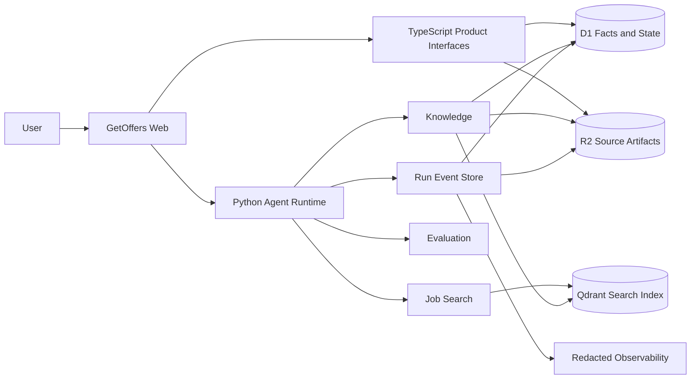

# GetOffers Career Agent System Design

## Purpose

GetOffers evolves from a job and application tracker into an evidence-grounded Career Agent. It helps a user discover suitable jobs, understand why they match, select truthful personal evidence, prepare for interviews, and create an Application Plan only after explicit approval.

The system is not an autonomous application bot. It does not treat job search as generic RAG, and it does not treat uploaded documents as authoritative facts until relevant claims are confirmed.

## Product shape



## Runtime separation

The existing TypeScript application remains the product and fact layer. It owns authentication, user-facing pages, application facts, Application Plans, document metadata, permissions, and approval interaction. The current authenticated [applications interface](../../app/api/applications/route.ts) and [job-feed interface](../../app/api/jobs/route.ts) are the starting seams.

A Python module is added at `services/agent/`. It owns Agent orchestration, Job Search, Knowledge Retrieval, evaluation, and Run Trace construction. The browser talks to the TypeScript application; a product adapter supplies authenticated calls to the Python Runtime and maps approved Agent tools back to selected product interfaces.

The Python Runtime does not scrape UI state, read browser local storage, or gain direct unrestricted access to every product endpoint.

## Deep modules

### Agent Runtime

```python
AgentRuntime.run(request) -> AsyncIterator[RunEvent]
```

Owns bounded execution, context assembly, tool exposure, policy, approval, budgets, cancellation, checkpoints, replay, and parent/child Agent Runs. Model providers and event stores are injected adapters.

### Job Search

```python
JobSearch.search(request) -> JobSearchResult
```

Owns query interpretation inputs, Hard Constraint filtering, lexical and dense recall, fusion, reranking, diversity, score explanation, and index-version identity. It returns complete Ranked Jobs, not passages.

### Knowledge

```python
Knowledge.ingest(request) -> IngestionResult
Knowledge.retrieve(request) -> EvidencePack
```

Owns parsing adapters, Canonical Document construction, Evidence Unit creation, indexing, citation locators, Candidate Fact proposals, version activation, reindexing, and deletion orchestration.

### Evaluation

```python
Evaluation.run(request) -> EvaluationReport
```

Owns version-pinned experiments, paired Baseline/Challenger execution, deterministic and model-based graders, regression reporting, and release-gate decisions.

## Data ownership

| Data | System of record | Derived/index copy |
|---|---|---|
| Application facts and plans | D1 | Search/read projections as needed |
| Document metadata, versions, ACL | D1 | Qdrant payload metadata |
| Candidate Facts and review status | D1 | Job-ranking feature view |
| Immutable uploaded files | R2 | Canonical/preview artifacts in R2 |
| Job versions | D1 | `job_versions_v1` in Qdrant |
| Evidence Units and locators | D1/R2 | `evidence_units_v1` in Qdrant |
| Run Event envelope and indexes | D1 or local Event Store | OpenTelemetry projections |
| Large restricted trace payloads | R2 | No ordinary telemetry copy |

Qdrant is a rebuildable index, never the fact source. R2 object keys include tenant, document, version, and content hash because R2 bucket versioning is not assumed.

## Primary product workflows

### Job Discovery

1. Load trusted Candidate Facts, Hard Constraints, and Soft Preferences.
2. Interpret the current search request.
3. Ask one blocking question only when a missing Hard Constraint would materially change eligibility.
4. Retrieve and rank complete Job Versions.
5. Retrieve Job Evidence and User Evidence for the top candidates.
6. Generate Decision Explanations.
7. Validate constraints, citations, and unsupported claims.
8. Present Ranked Jobs.
9. If the user selects a job, propose a concrete Application Plan.
10. Execute the exact write only after approval.

### User Knowledge ingestion

1. Validate upload type and size and calculate a content hash.
2. Store an immutable Source Artifact.
3. Create a Document Version.
4. Parse through a format Adapter into a Canonical Document.
5. Build document-aware Evidence Units.
6. Run parsing and segmentation quality checks.
7. Build a non-active index version.
8. Atomically activate it after validation.
9. Propose Candidate Facts for user confirmation.

### Mock interview

Mock interview is a later Career Workflow. It retrieves user project evidence and job requirements, asks progressive questions, evaluates answers against evidence, and produces a review. V1 may implement it as a mode of the single Career Agent; a dedicated Interview Agent and handoff are enabled only after paired evaluation demonstrates a benefit.

## Multi-Agent policy

The product always presents one Career Agent. V1 uses one Agent plus deterministic workflows and deep tool modules. The Runtime supports parent/child Agent Runs, delegation, parallel join, budgets, cancellation, and trace correlation from the start.

V2 may test read-only Job Analyst Agents for parallel comparison of several jobs. Multi-Agent execution becomes a default only when it improves quality enough to justify additional tokens, cost, p95 latency, and failure modes on the same Evaluation Cases.

## Repository target

```text
GetOffers/
├── app/                         # TypeScript UI and product interfaces
├── db/                          # D1 schema and product persistence
├── services/agent/
│   ├── pyproject.toml
│   ├── src/getoffers_agent/
│   │   ├── runtime/
│   │   ├── career/
│   │   ├── job_search/
│   │   ├── knowledge/
│   │   ├── evaluation/
│   │   └── adapters/
│   └── tests/
├── datasets/evals/
├── CONTEXT.md
└── docs/
```

The directories describe ownership, not a requirement to create one class per file. Each module should keep a small external interface and hide replaceable implementation detail behind internal seams.

## Explicit non-goals for V1

- Autonomous job application or submission.
- Unconfirmed recruitment-site writes.
- Multi-Agent execution enabled by default.
- Online reinforcement learning or automatic weight updates from clicks.
- Fine-tuning.
- Support for every file format.
- A managed black-box RAG product as the core implementation.
- Claims of enterprise customer-service production outcomes.
- Resume metrics before reproducible experiments exist.

## Decisions and empirical choices

Architectural decisions are recorded under [ADRs](../adr/). Exact metric thresholds, final Embedding/Reranker models, and final hosted Runtime deployment remain empirical choices. They are selected through the frozen evaluation process rather than by editing the architecture narrative after seeing a desirable result.
